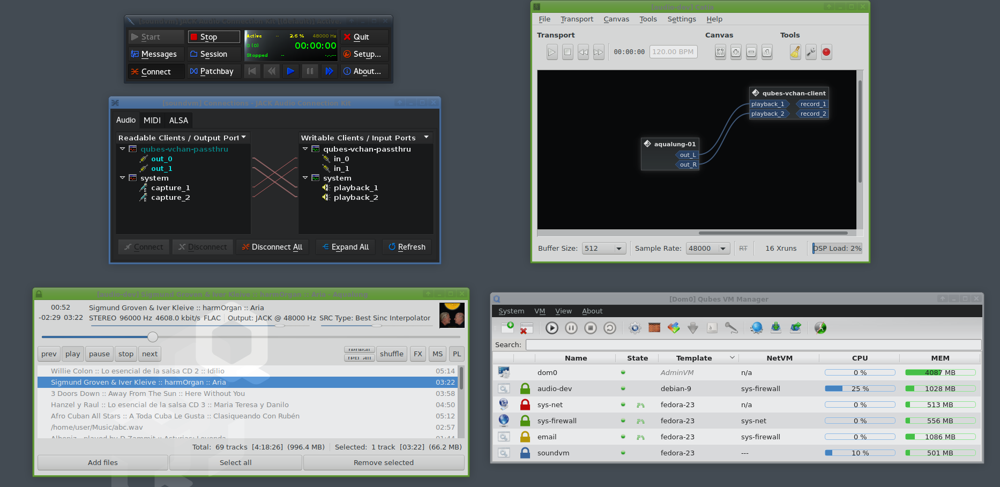

qubes-jack
==========

Native JACK support for Qubes OS


Basic idea
==========

```
+--------------+
|              +-- Physical Output Ports
|  Soundcard   |
|              |
|              +-- Physical Input Ports
+------+-------+
       |
      I/O
      BUS
       |                +--------------+
+------+-------+        |              |
|      |SoundVM|   +----+--JACK(dummy) |
|    Kernel    |   |    |        AppVM1|
|    Driver    |   |    +--------------+
|    (ALSA)    |   |    +--------------+
|      |       |   |    |              |
|     JACK---VCHAN-+----+--JACK(dummy) |
|    SERVER    |        |        AppVM2|
+--------------+        +--------------+
```

The proposed idea is that a separate SoundVM is hosted by the backend vmm,
which has raw access to the sound card and runs the kernel driver for the card natively.
JACK server would run on top of this and a qubes-vchan-jack-passthru application would
attach to JACK server. This can be described as a simple jack client to vchan server.
It relays the sound data to and from other AppVMs via a set of vchan ports.
The AppVMs would run a dummy instance of JACK server (with no sound hardware).
Each AppVM requiring sound would run such a dummy instance of jackd and 
also run its own instance of a client jack application that connects
to the vchan ports as a client, relaying the sound data via vchan and exposing native JACK ports.
The native JACK ports within the AppVMs can be used as regular system hardware ports,
transparently relaying the sound data to the underlying JACK server on the SoundVM.

Demo
====


